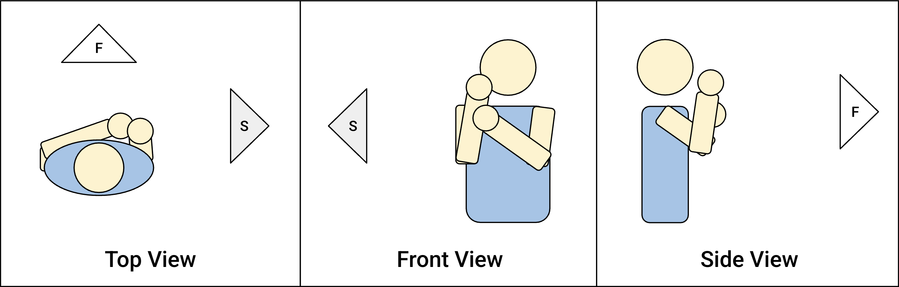

# Violarm
Violarm is a real-time virtual violin, played by tapping notes on the arm.

## Overview

Violarm uses a dual-camera setup: a "Front" webcam and a "Side" external camera.

- Front Camera (Laptop Webcam)
    - Faces the player
    - Tracks finger placement on the fingerboard

- Side Camera (External/Phone Camera)
    - Positioned perpendicular to the player on the right
    - Determine whether fingers are pressing the fingerboard

---

**Ode to Joy Performance:**

https://github.com/user-attachments/assets/03ee2a72-3b4f-4d37-8bd1-3d62c2163463
